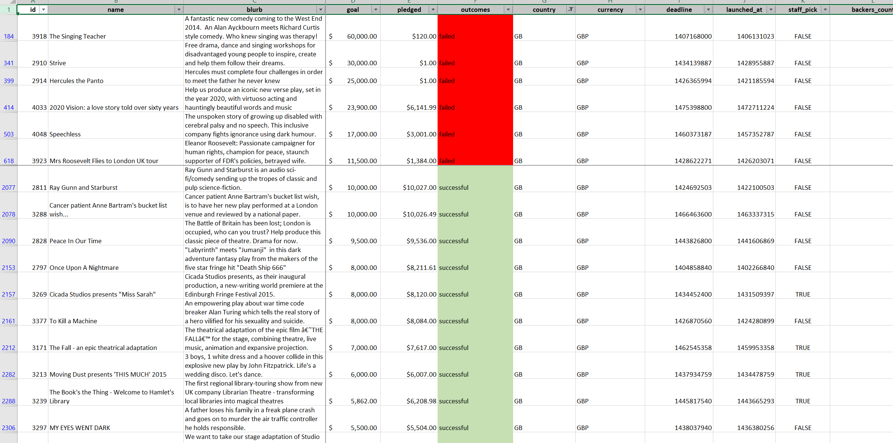
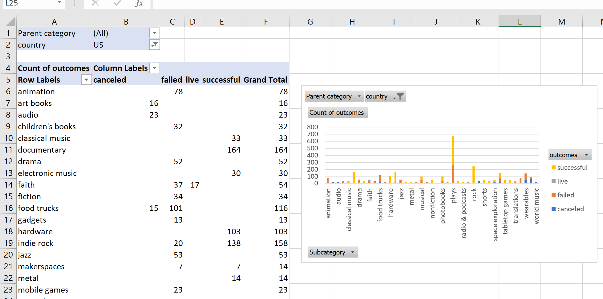
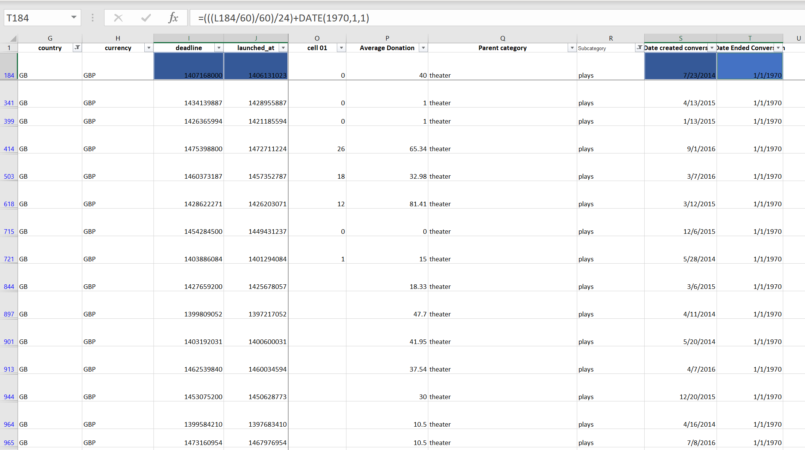
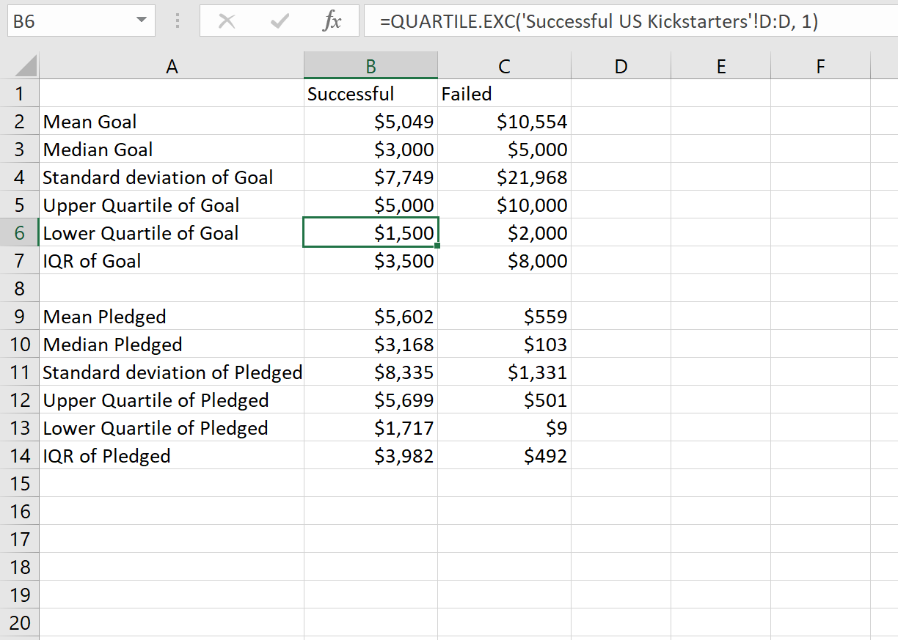
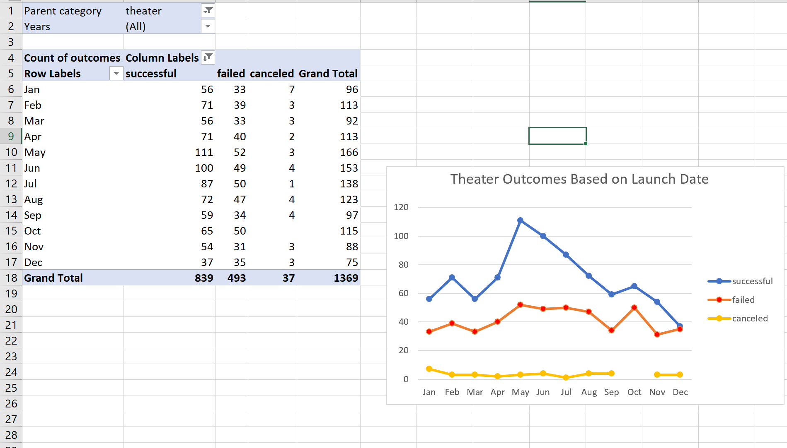
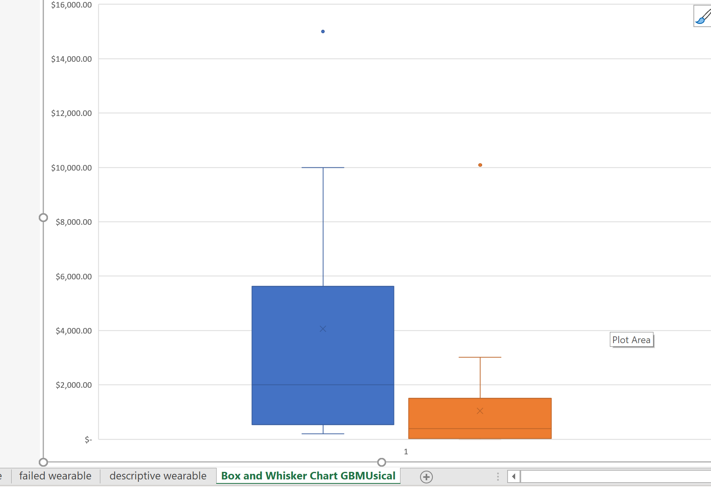
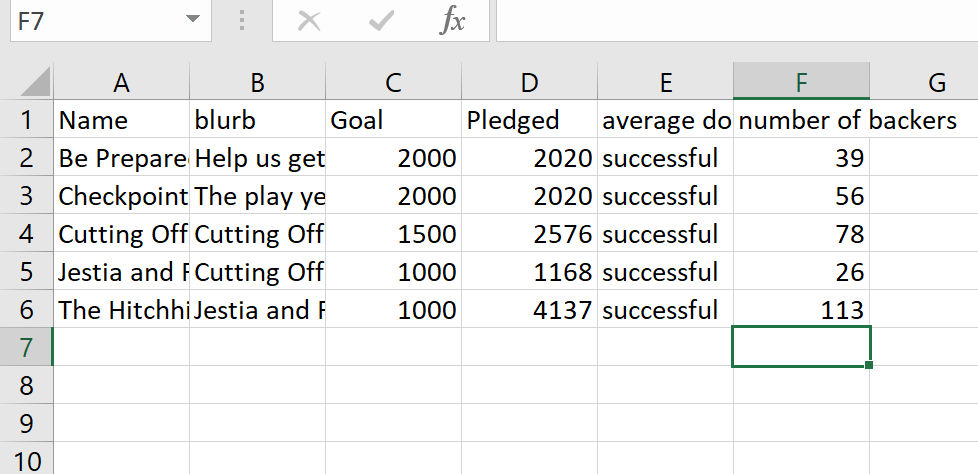

# KIckstarter-analysis
Performing analysis on Kickstarter data to uncover trends

## Overview of Project
Louise estimates that her play will cost $12,000, so we want to use data from the Pledged column to research projects with a similar monetary goal and how much money each campaign will need to succeed, using the country in which the campaign was started.

## Purpose
The analysis aimed to help Louise plan her crowdfunding campaign for her play in the US and a future musical in Great Britain by determining historically pledged and goals met from previous campaigns.

## Analysis and Challenges
 
 Before starting the analysis, we debugged the data set to cleaned up and fixed every error to make sure the data was readable. There are various categories and subcategories of campaign, but we worked with the “theater” subset, since that is what Louise is interested in. To have a better understanding and to lend strength to our analysis, we used visualization by creating summary tables and charts to compare the outcomes of various campaigns in all the categories.

  
### Analysis of Outcomes Based on Launch Date

Considering that the scope of the subcategory is still a bit broad, we filtered the charts to only visualize theater and plays. We also filtered to a single play.

.png)

### Analysis of Outcomes Based on Goals

With visualization, we compared campaigns across the various categories using the parent category and created a visualization that was more specific for Louise, “theatrical productions”, using subcategories.

### Challenges and Difficulties Encountered

The dates in the data were not readable but we fixed those by converting them to human readable formats using excel formula. Also, Outliers, these are not representative of the needed data, so we fixed these using median and interquartile range (IQR) together because of their high sensitivity to outliers, following these guidelines:
*Any value greater than the upper quartile plus 1.5 x IQR is considered an outlier.
*Any value less than the lower quartile minus 1.5 x IQR is considered an outlier.

## Results

- What are two conclusions you can draw about the Outcomes based on Launch Date?

1. There were a total of 1369 campaigns in the US and there were 839 successful campaigns with the month of May having the most successful campaign with 111 and most failed campaigns in November with a count of 31. There were 439 campaigns that failed, and 37 campaigns were canceled. 

2. To further deepen our analysis and to make decision with precision and confidence about the campaign strategy, statistical analysis was carried out to have an unbiased data. We saw that failed campaigns had high fundraising goals, mean goal was $10,554 while the mean pledged was $559. However, because the mean ($559) and median ($103) failed pledged amounts are much lower than the successful mean ($5049) and median ($3000) pledges, we cannot conclude that high fundraising goal alone is the reason for the failed fundraising campaigns.

- What can you conclude about the Outcomes based on Goals?

The most successful campaign 76% had a goal less than $1000 while the least successful campaign had a goal ranging between $45000 and $49999. There is an equal chance of success and failure for play campaigns with goals ranging between $15000 to $19999.

- What are some limitations of this dataset?

The dataset includes some data that were not relevant to the analysis

- What are some other possible tables and/or graphs that we could create?

1. outside of the US, Louise is also interested in researching musicals in Great Britain, so we could create a Box plot to compare the pledged and goals with Louise’s estimated budget of €4000.

 
2. Louise is particularly interested in five plays; we could use VLOOKUP function to determine the necessary information about the plays’ campaign.

